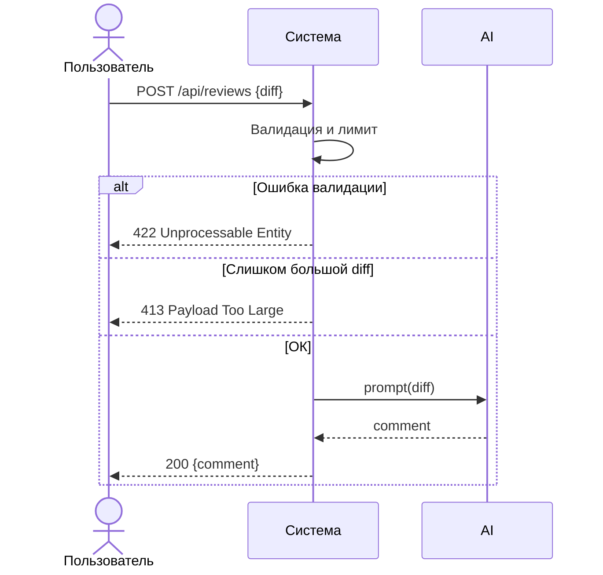

# Use cases и user stories

Файл ведёт OpenCode. Обсудите с агентом содержание и проверьте предложенный diff. Все дополнения и исправления поручайте агенту в чате.

## Первый рабочий сценарий

Когда клиент (разработчик или CI) отправляет в API POST /api/reviews JSON {"diff": "..."}, система валидирует вход и размер, передает diff в сервис ревью, получает от LLM комментарий и возвращает {"comment": "..."}, а пользователь получает предсказуемый и задокументированный ответ без 500.

Не входит в этот сценарий:

- Выбор и внедрение аутентификации.
- Замена или тюнинг конкретного LLM-провайдера.
- Внешний UI.

## Use case

| Поле | Значение |
|---|---|
| Актор | Разработчик, CI/бот |
| Триггер | Появился кодовый diff, который нужно проверить |
| Предусловия | Доступен API; формат входа JSON с полем diff; размер не превышает лимит |
| Основной результат | HTTP 200 и тело {"comment": "..."} |
| Ошибка или отказ | HTTP 422 при невалидном входе; 413 при превышении лимита; 502/503 при сбое LLM |



## User stories и acceptance criteria

```gherkin
Feature: API для безопасного AI code review

  Scenario: Позитивный ответ
    Given доступен эндпойнт POST /api/reviews
    And вход содержит JSON с ключом diff и строковым значением размером <= 64 KB
    When клиент отправляет запрос
    Then сервис возвращает 200 и JSON {"comment": "..."}

  Scenario: Негативный - отсутствует ключ diff
    Given доступен эндпойнт POST /api/reviews
    And вход не содержит ключа diff
    When клиент отправляет запрос
    Then сервис возвращает 422 с сообщением о невалидном входе

  Scenario: Граничный - превышение лимита
    Given доступен эндпойнт POST /api/reviews
    And размер diff превышает 64 KB
    When клиент отправляет запрос
    Then сервис возвращает 413 Payload Too Large
```

## Как использовали AI

- Для чего: описать сценарии использования, user stories и критерии на основе контекста и проблемы.
- Тип промпта: master prompt, см. P1-02.
- Строка в prompts.md: раздел Master Prompt v1 и P1-02.
- Что проверил студент и какие исправления поручил агенту: согласовали границы сценария с context.md, добавили негативные и граничные случаи.
