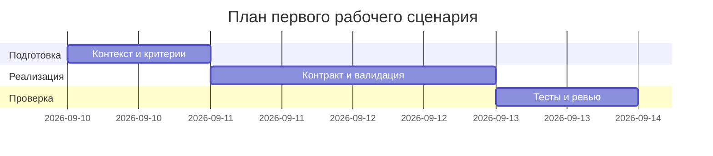

# План поставки

Файл ведёт OpenCode. Обсудите с агентом содержание и проверьте предложенный diff. Все дополнения и исправления поручайте агенту в чате.

## Инкременты и ответственность

| Инкремент | Наблюдаемый результат | Что делает человек | Что делает AI или субагент | Проверка | Зависимости |
|---|---|---|---|---|---|
| 1 | Определен контракт API и лимиты | Фиксирует context.md, problem.md | Предлагает список рисков и тестов | Ревью P1-01 и P1-02; обновления в файлах | TRAINING_PR.diff |
| 2 | Добавлены модели запроса/ответа и валидация | Разрешает границы и коды ошибок | Генерирует шаблон Pydantic-моделей и обработку ошибок | Интеграционные тесты 422/413/502 | Инкремент 1 |
| 3 | Набор тестов и SLA цели | Подтверждает SLA и лимит | Предлагает тест-кейсы и нагрузочные параметры | Unit, integration, load, e2e | Инкременты 1-2 |

## Диаграмма Ганта

Передайте OpenCode даты и задачи своего плана и попросите обновить диаграмму.

## Как использовали AI

- Для чего: разложить работу на инкременты и проверки с учетом найденных рисков.
- Тип промпта: master prompt как контракт для ревью diff.
- Строка в prompts.md: P1-02 и раздел Сравнение двух запусков.
- Что проверил студент и какие исправления поручил агенту: согласовали зависимостей и критерии проверки, зафиксировали сроки как ориентиры.
